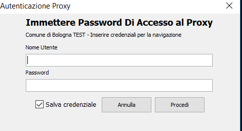

# Arubasign

Con  Arubasign è possibile

- Apporre Firme Digitali in formato .P7M
- ApporreFirme Digitali in formato .PDF
- Apporre Marche Temporali
- VerificareFirme Digitali in formato .P7M e .PDF
- Verificare Marche Temporali
- Gestire Pin e Puk della smart card

## Installazione da utente

>Installare Arubasign con l’utenza dell’utilizzatore se la si fa con VNC non è necessario disconnettere l’utente o fare “esegui come amministratore”

1. copiare sul disco del PC C:\ la cartella \\cobosrv6\apcobo\Firma Digitale\SW_ArubaSign\

2. oppure scarica <a href="firma-digitale/asset/SW_ArubaSign/ArubaSign-4.2.4.exe" download="ArubaSign-4.2.4.exe">ArubaSign-4.2.4.exe</a>

3. eseguire con l’utente dell'utilizzatore (quindi non utente PCMGM… ) C:\SW_ArubaSign\ArubaSign-x.x.x.exe

4. quando compare la segnalazione

    

    cliccare **SI**

5. quando richiesto

    

    modificare il percorso in  C:\ArubaSign (rispettare le Maiuscole)

6. al termine dell’installazione

    

    togliere la spunta ad Avvia Arubasign

7. Terminata l’installazione sia in caso di 32 bit  o 64 bit in base al s.o.  spostare  il collegamento arubasign creato  sul desktop dall'installazione (visibile solo dall’utente che ha installato)    nel desktop public o di all users 
eliminare la cartella C:\ SW_ArubaSign

### Avviare Arubasign

se compare la maschera di richiesta autenticazione proxy

Cliccare sul menu Opzioni e paramentri, scegliere l'etichetta Firma Remota e digitare frCOBO (rispettando maiuscole e minuscole)

### Utilizzo per Firma remota

andare nella scheda firma remota

spuntare specifica dominio e immettere il valore frCOBO

e poi salva

chiudere arubasign

## FAQ

ppeecchéééé