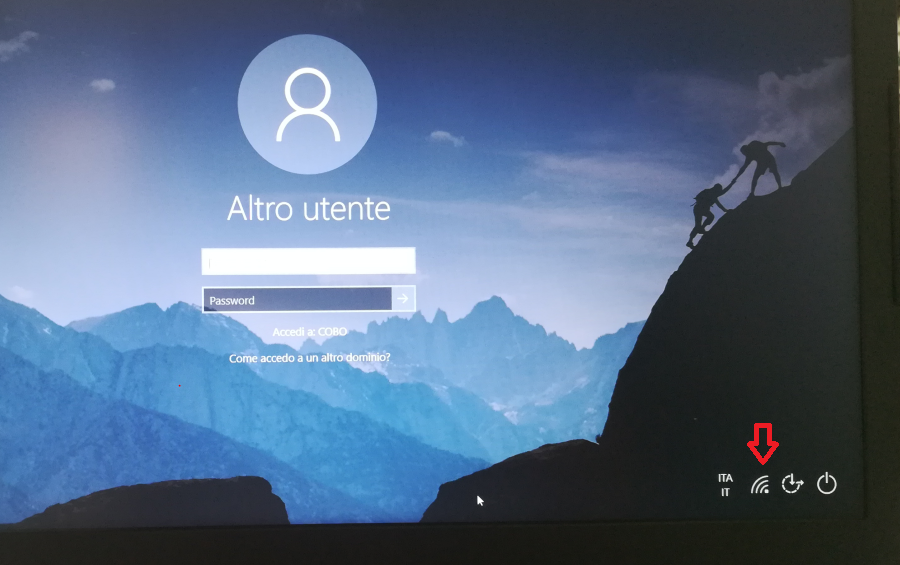
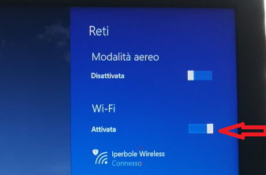
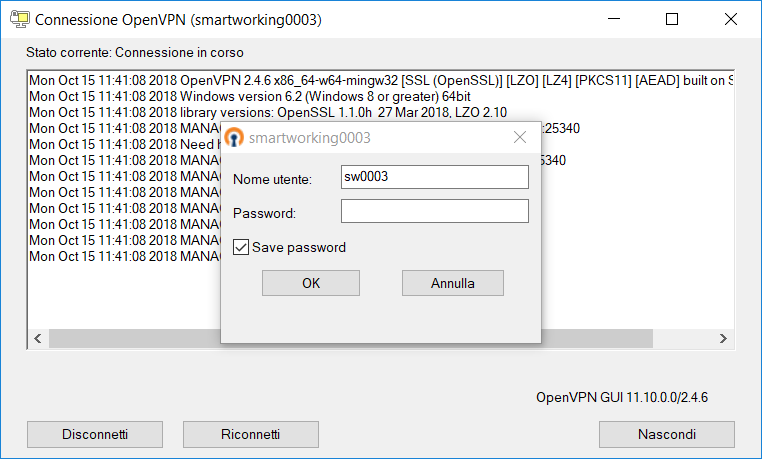
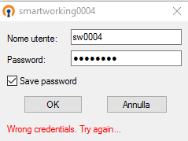
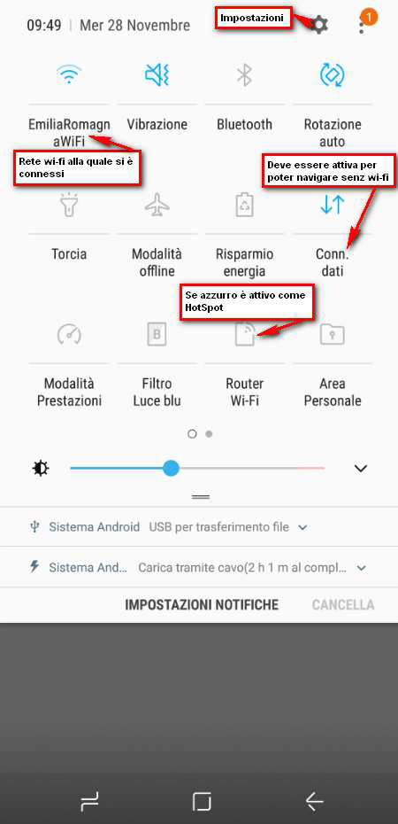
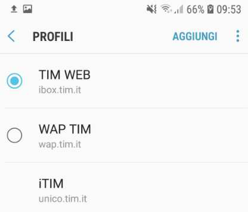
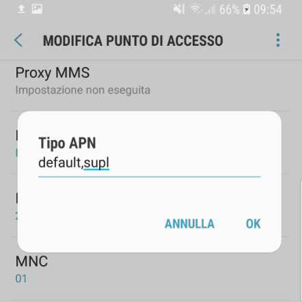
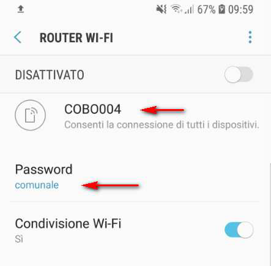

# Smartworking: collegamento alla rete comunale

elaborato da XXX il 20 nov 2018   ultimo agg.to 1 feb 2019

## **La dotazione**

- Software:
  - OpenVpn per per collegare il portatile alla rete comunale,
  - FreeOtp: app sul telefono per generare il codice da inserire nella richiesta di accesso alle rete VPN da parte di openVPN
  - etc...
  
- Hardware:
  - Portatile
  - dockingstation
  - monitor - tastiera e mouse in ufficio

## **Accesso dal proprio ufficio**

1. Collegare il portatile alla docking station con un unico cavo USB.
2. collelare alla docking station tutte le periferichi (la tastiera, mouse e video) e il cavo di rete alla rete aziendale.
3. Accendere il portatile e nella maschera di accesso prima di effettuare l’accesso verificare che il wifi sia disattivato (fig.01): cliccare sul simbolo del WIFI per verificarlo.

  
  FIG.01: cliccare sul simbolo del WIFI per aprire il pannello reti prima di accedere al PC.
4. Se è attivo è necessario disattivare il wifi (fig.02)

   fig.02 disattivare il wifi
5. Accedere utilizzando le  proprie credenziali di rete

## **Accesso con il WIFI**

i passassagi sono:

- A: attivare la connessione al wifi

- B: utilizzare OpenVpn per accedere tramite VPN (= rete protetta) alla rete del Comune

- C: utilizzare FreeOtp per produrre la password e attivare la vpn

### A. Attivare la connessione wifi

1. Accendere il portatile  accedere con le proprie credenziali di rete.
2. Attendere la comparsa di tutte le icone sulla barra degli strumenti in basso a destra.
3. Verificare di  avere la WIFI attiva e di essere connessi a una rete wireless cliccando sul simbolo della rete wireless (fig.03)
  
  fig.03 barra degli strumenti e icona wifi
4. se necessario connettersi ad una rete wireless
  
  fig.04 pannello per l'attivazione wifi

### B. OpenVpn

 1. Fare click con il tasto destro sull’icona di OpenVpn per attivare la VPN con la rete del Comune
  
  fig.5 icona openVpn nella barra degli strumenti
 2. Cliccare su “Connetti” e comparirà la finestra di connessione (FIG.6):
  
  fig.6 finestra di connessione OpenVPN
 3. usare FreeOpt per produrre la password.
 4. Inserire una nuova password numerica ottenuta con FreeOtp

> Se è la prima volta dall'accensione del computer inserire la password numerica ottenuta con l’app FreeOtp installata sullo smartphone (il nome utente dovrebbe comparire da solo,  ogni utente ha il proprio nome sw000## codificato per lo smartwork) e se non presente il flag in “Save password” mettere la spunta su “Save password”

> La password rimarrà valida per 24 ore, quindi in caso di riconnessione basterà cliccare su ok o aspettare che si riconnetta automaticamente. Il giorno successivo occorrerà inserire una nuova password numerica, ottenuta sempre con FreeOtp al posto degli asterischi.  Per interrompere il conto alla rovescia basta posizionare il mouse sul campo password.

!> Se non si riesce a modificare la password in tempo  o la password inserita non è corretta compare la maschera di fig.8

   fig.8 finestra con avviso di credenziali non valide
 5. Se la connessione va a buon fine l’icona nella barra delle applicazioni diventerà VERDE e comparirà come popup per qualche secondo un avviso con le informazioni sulla connessione (fig.9)

  
  fig.9 icona verde di OpenVpn

 Da questo momento il pc è connesso alla rete comunale COBO ed è possibile utilizzare i programmi come dall’ufficio.
 Si consiglia di verificare di avere i dischi di rete correttamente connessi, in caso contrario disconnettere la VPN (tasto destro sull’icona – DISCONNETTI)e connettere di nuovo la VPN.

!> Dopo la connessione della VPN o lo sblocco del portatile compare per qualche secondo una finestra blu (fig.10). Se non scompare dopo qualche secondo per iconizzare la finestra cliccare su   -   ( non cliccare su X ).

 fig.10 powershell.

#### Disconnessione dalla VPN

 1. A fine lavoro disconnettere la VPN (tasto destro sull’icona – DISCONNETTI)
  

### C. FreeOtp

 FreeOtp è il software per ottenere la password necessaria per il collegamento VPN
 

## **Accesso da cellulare**

1. Attivare sullo smartphone l’hotspot configurato
2. Accendere il portatile e accedere con le proprie credenziali di rete.
3. Attendere la comparsa di tutte le icone sulla barra degli strumenti in basso a destra.
Cliccare sul simbolo del WIFI

 

 se necessario attivare il WIFI  e connettere il portatile alla rete wireless  fornita dallo smartphone (C’E’ UNO STANDARD sul nome della rete?).
Attivare la VPN con la rete del Comune come descritto nel paragrafo precedente

### Verificare l’hotspot

Scorciatoia per verifica Impostazioni principali :
si visualizza scorrendo sul display dall’alto verso in basso

### Impostare l’hotspot

In alternativa cercare fra le applicazioni la rotella di Impostazioni 

1. Connessioni: per verificare se la connessione dati è attiva andare su -> Reti Mobili -> Profili: deve essere spuntato TIM WEB (fig.14)

  
  fig.14
2. Per verificare che sia correttamente configurato entrare dentro TIM WEB cliccandoci sopra poi scorrere verso il basso fino a trovare Tipo APN che deve essere impostato su: **default,supl** (fig.15)

  
  fig.15
3. Se risulta impostato su '**dun**' cliccarci sopra e scrivere l’impostazione '**default,supl**' e cliccare su **ok**.
4. Salvare, dai tre puntini in alto a destra, prima di uscire.

Se fosse impostato correttamente e continui a non connettersi provare da:

 -> Profili --> cliccare sui 3 puntini in alto a destra a --> Ripristinare impostazioni predefinite --> ripetere la configurazione come sopra.

Per verificare il nome della connessione quanto si utilizza lo smartphone come Router thetering wi-fi da:

--> Connessioni --> Router wi-fi e tethering --> Router Wi-Fi

fig.16

## **FAQ**

[FAQ](/FAQ.md ':include')